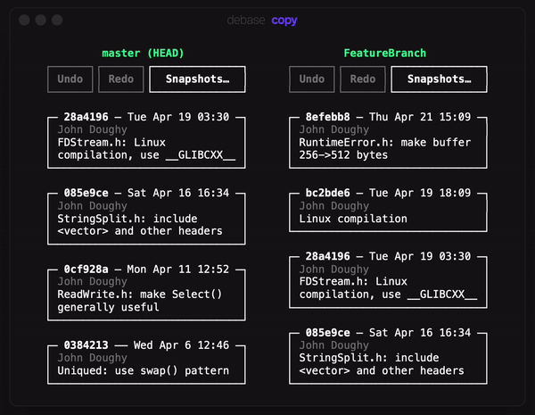

# debase

`debase` makes editing git history easier by allowing you to move / copy / edit / delete commits with a mouse.

Full details: [toaster.llc/debase](https://toaster.llc/debase).

## Download

Compiled binaries are available at [toaster.llc/debase](https://toaster.llc/debase).

## Build for macOS

    # x86_64 + arm64
    make -j8
    
    # x86_64 only
    make -j8 ARCHS=x86_64

## Build for Linux

    make -j8

